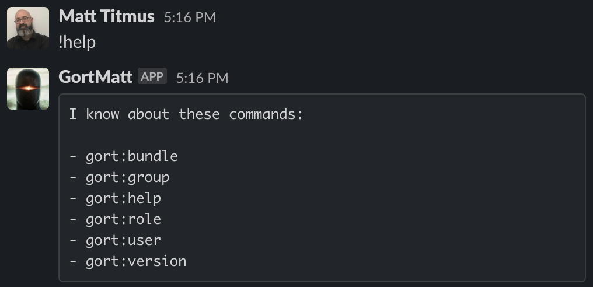

# Output Format Templates

Output format templates allow the look and feel of any messages sent to users, including both Gort system messages and command output, to be customized (within the constraints imposed by a given chat provider). Properly used, templates can provide a very powerful tool for maximizing the user experience.

## The four template types

The are four template types:

* _Command templates_, which are used to format the outputs from successfully executed commands.
* _Command error templates_, which are used to format the error messages produced by commands that exit with a non-zero status.
* _Message templates_, which are used to format standard informative (non-error) messages from the Gort system (not commands).
* _Message error templates_, which are used to format error messages from the Gort system (not commands).

Each of these have default values built into Gort, but each may be customized via the `templates` block of the [Gort configuration](configuration.md). Furthermore, the _command_ and _command error_ templates may be further customized per bundle, or even per command. 

## Template Basic Format

Gort templates use Go's [template syntax](https://pkg.go.dev/text/template) to format output in a chat-agnostic way.

For example, a very simple _command template_ might look something like the following:

```
{{ text | monospace true }}{{ .Response.Out }}{{ endtext }}
```

This template emits the command's response (`.Response.Out`) as monospaced text, which may look something like the following:



A slightly more complicated template, this one a _command error template_ (actually the default), is shown below.

```
{{ header | color "#FF0000" | title .Response.Title }}
{{ text }}The pipeline failed planning the invocation:{{ endtext }}
{{ text | monospace true }}{{ .Request.Bundle.Name }}:{{ .Request.Command.Name }} {{ .Request.Parameters }}{{ endtext }}
{{ text }}The specific error was:{{ endtext }}
{{ text | monospace true }}{{ .Response.Out }}{{ endtext }}
```

This one includes a header with a color and title, as well as some alternating monospaced and standard text. In this case, this will format a command error something like the following:


Sure that's nice and all, but what's all this `.Response` stuff? That's part of what's called the "response envelope", a data structure that's accessible from any template, which makes available all of the data and metadata around one command request, execution, and response. The response envelope is discussed in detail in [The Response Envelope](templates-response-envelope.md).

The available template tags and functions are also fully presented in [Template Functions](templates-functions.md).